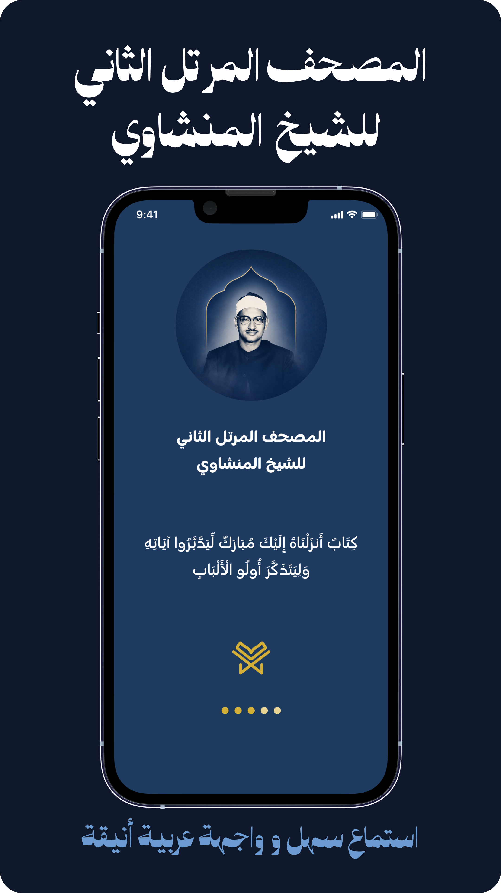

# 📖مصحف المنشاوي

<div align="center">

تطبيق قرآن كريم يتيح الاستماع إلى **المصحف المرتل الثاني كاملًا** بصوت الشيخ **محمد صديق المنشاوي** رحمه الله، مع تجربة استخدام عربية سهلة وتصميم عصري يوفر تجربة استماع مريحة ومميزة.

</div>

---

## ✨ المميزات

* 🎧 الاستماع إلى جميع سور القرآن الكريم.
* 📥 تحميل السور للاستماع بدون اتصال بالإنترنت.
* ❤️ إضافة السور إلى قائمة المفضلة.
* ⏯️ استكمال التشغيل من آخر موضع استماع.
* 🔔 إشعارات للتحكم في التشغيل والإيقاف.
* 📚 معلومات تراثية عن الشيخ محمد صديق المنشاوي.
* 🖼️ معرض صور مميز للشيخ رحمه الله.
* 🌙 واجهة عربية حديثة وسهلة الاستخدام.
* ⚡ أداء سريع وتجربة استخدام سلسة.

---

## 📱 لقطات من التطبيق

```md



```

---

## 🛠️ التقنيات المستخدمة

* Flutter
* Dart
* Bloc / Cubit
* Hive
* Dio
* Just_audio
* audio_player
* Flutter Local Notifications
* Font Awesome Flutter
* SVG Support

---

## 📂 هيكل المشروع

```text
lib/
├── core/
├── models/
├── services/
├── presentation/
│   ├── cubits/
│   ├── views/
│   └── widgets/
└── main.dart
```

---

## 🚀 تشغيل المشروع

### Clone Repository

```bash
git clone https://github.com/your-username/minshawy-quran-app.git
```

### Go To Project

```bash
cd minshawy-quran-app
```

### Install Dependencies

```bash
flutter pub get
```

### Run App

```bash
flutter run
```

---

## 🎙️ عن الشيخ محمد صديق المنشاوي

الشيخ محمد صديق المنشاوي رحمه الله أحد أعلام التلاوة في العالم الإسلامي، تميز بصوت خاشع وأداء مؤثر جعل تلاواته من أكثر التلاوات انتشارًا ومحبة بين المسلمين حول العالم.

---

## 📌 ملاحظات

* التطبيق خالٍ من الإعلانات.
* لا يتم جمع أو مشاركة أي بيانات شخصية للمستخدمين.
* بعض المميزات تتطلب اتصالًا بالإنترنت عند الاستماع المباشر.
* يمكن الاستماع للسور المحملة دون الحاجة إلى الإنترنت.

---

## 👨‍💻 المطور

**Muhammed Ahmed Abdelhadi Khalifa**

Flutter Developer | Computer Science Student

### تواصل معي

* LinkedIn: www.linkedin.com/in/muhammedahmedabdelhadi
* Email: muhammed.abdelhadi9@gmail.com
* WhatsApp: +201090820457

---

## 🤲 دعاء

نسأل الله أن يجعل هذا العمل خالصًا لوجهه الكريم، وأن ينفع به المسلمين في كل مكان.

> "خيركم من تعلم القرآن وعلمه"

---

## 📄 License

This project is licensed under the MIT License.
